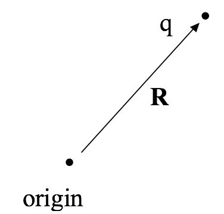
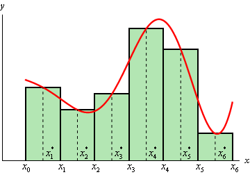

<section data-markdown="">
### PH410 - Electromagnetism

September 6
<!--this doesn't work... -->
</section>

<section data-markdown>
While waiting for class to start, answer on Slack (if the internet is working today...)
	
A point charge ($q$) is located at position $\mathbf{R}$, as shown. What is $\rho(\mathbf{r})$, the charge density in all space?

1. $\rho(\mathbf{r}) = q\delta^3(\mathbf{R})$
2. $\rho(\mathbf{r}) = q\delta^3(\mathbf{r})$
3. $\rho(\mathbf{r}) = q\delta^3(\mathbf{R}-\mathbf{r})$
4. $\rho(\mathbf{r}) = q\delta^3(\mathbf{r}-\mathbf{R})$
5. Something else??

Note:
* CORRECT ANSWER: E
* This one is a curious one because a delta function is always positive, both C and D are correct.
* Expect most everyone to pick C

</section>

<section data-markdown="">

### This afternoon
- Homework 1 due

### For Monday
- Read Griffiths 2.1
- Reading survey s4 due at 10am 

### For next Friday
- HW2 due
	
</section>

<section data-markdown>
Keeping in mind $\int_{-\infty}^{+\infty} f(x)\delta(x)dx=f(0)$, what are the units of $\delta (x)$ if $x$ is measured in meters?

1. $\delta(x)$ is dimension less (‘no units’)
2. [$\mathrm{m}$]:      Unit of length
3. [$\mathrm{m}^2$]:    Unit of length squared
4. [$\mathrm{m}^{-1}$]:   1 / (unit of length)
5. [$\mathrm{m}^{-2}$]:   1 / (unit of length squared)

Note:
* CORRECT ANSWER: D
* Think about what the integral must produce.

</section>
<!--
<section data-markdown>

What are the units of $\delta^3(\mathbf{r})$ if the components of $\mathbf{r}$ are measured in meters?

1. [$\mathrm{m}$]:      Unit of length
2. [$\mathrm{m}^2$]:    Unit of length squared
3. [$\mathrm{m}^{-1}$]:   1 / (unit of length)
4. [$\mathrm{m}^{-2}$]:   1 / (unit of length squared)
5. None of these.

Note:
* CORRECT ANSWER: E
* Should be m^-3

</section>
-->
<section data-markdown>

What is the divergence in the boxed region?

1. Zero
2. Not zero
3. ???

Note:
* CORRECT ANSWER: A
* Just a check back in.
</section>

<section data-markdown>

We have shown twice that $\nabla \cdot \mathbf{E} = 0$ using what seem to be appropriate vector identities. But physically, $\nabla \cdot \mathbf{E} = \rho/ \varepsilon_0$. What is going on?!

</section>

<section data-markdown>

## Numerical Integration

</section>

<section data-markdown>

Consider this trapezoid

What is the area of this trapezoid?

1. $f(c)h$
2. $f(d)h$
3. $f(c)h + \frac{1}{2}f(d)h$
4. $\frac{1}{2}f(c)h + \frac{1}{2}f(d)h$
5. Something else

Note:
* Correct Answer: D
</section>

<section data-markdown>

The trapezoidal rule for a function $f(x)$ gives the area of the $k$th slice of width $h$ to be,

$$A_{k} = \frac{1}{2}h\left(f(a+(k-1)h) + f(a+kh)\right)$$

What is the approximate integral, $I(a,b) = \int_a^b f(x) dx$, $I(a,b) \approx$

1. $\sum_{k=1}^N \frac{1}{2}h\left(f(a+(k-1)h) + f(a+kh)\right)$
2. $h\left(\frac{1}{2}f(a) + \frac{1}{2}f(b) + \frac{1}{2}\sum_{k=1}^{N-1}f(a+kh)\right)$
3. $h\left(\frac{1}{2}f(a) + \frac{1}{2}f(b) + \sum_{k=1}^{N-1}f(a+kh)\right)$
4. None of these is correct.
4. More than one is correct.

Note:
* Correct Answer: D (both A and C)

</section>

<section data-markdown>

The trapezoidal rule takes into account the value and slope of the function. The next "best" approximation will also take into account:

1. Concavity of the function
2. Curvature of the function
3. Unequally spaced intervals
4. More than one of these
5. Something else entirely

</section>
