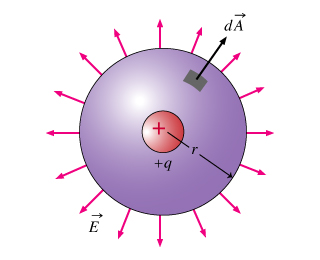
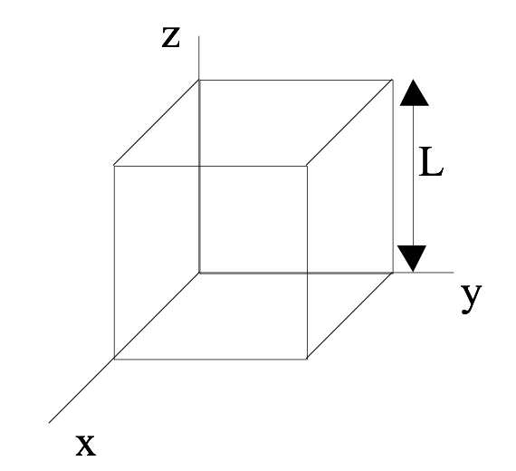
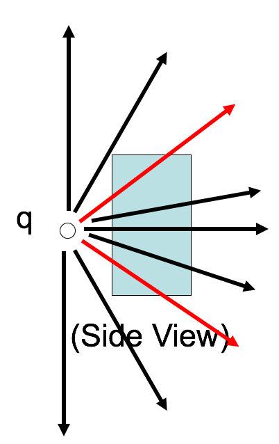

<section data-markdown="">

# DRAFT DRAFT DRAFT
### PH410 - Electromagnetism

September 11
<!--this doesn't work... -->
</section>
<section data-markdown>

Given the location of the little bit of charge ($dq$), what is $|\vec{\mathfrak{R}}|$?

1. $\sqrt{z^2+r'^2}$
2. $\sqrt{z^2+r'^2-2zr'\cos\theta}$
3. $\sqrt{z^2+r'^2+2zr'\cos\theta}$
4. Something else

Note:
CORRECT ANSWER: B

</section>

<section data-markdown="">

### For Friday
- no reading
- HW2 due
	
</section>

<section data-markdown>
	
### Tutorials

Work together as necessary, but make sure you're thinking through everything, not just copying.

</section>

<section data-markdown>
	
### Because of superposition, to find $\vec{E}$ we can:

- Start from Coulomb's Law: $\mathbf{E}(\mathbf{r})=k\int\frac{1}{\left|\mathfrak{r}\right|^2}\hat{\mathfrak{r}}dq$
- Express $dq \rightarrow \lambda~dl' \sim \sigma da' \sim \rho d\tau'$
- Compute the integral in convenient coordinates
</section>
<section data-markdown>
We obtained:
$$ADD DISK EQN HERE$$

If we are *far from the disk*, what is the small parameter in our Taylor expansion?

1. $x$
2. $a$
3. $x/a$
4. $a/x$
5. More than one of these

Note: Correct answer is D, but this is about a discussion about dimensionless parameters - small compared to what!
</section>
<section data-markdown>
We obtained:
$$ADD DISK EQN HERE$$

If we are *close to the disk*, what is the small parameter in our Taylor expansion?

1. $x$
2. $a$
3. $x/a$
4. $a/x$
5. More than one of these

Note: Correct answer is C, but this is about a discussion about dimensionless parameters - small compared to what!
</section>

<section data-markdown>

Which of the following are vectors?

(I) Electric field, (II) Electric flux, and/or (III) Electric charge

1. I only
2. I and II only
3. I and III only
4. II and III only
5. I, II, and II

Note:
* CORRECT ANSWER: A

</section>

<section data-markdown>

## Gauss' Law

$$\oint_S \mathbf{E}\cdot d\mathbf{A} = \int_V \dfrac{\rho}{\varepsilon_0}d\tau$$

</section>

<section data-markdown>

The space in and around a cubical box (edge length $L$) is filled with a constant uniform electric field, $\mathbf{E} = E_0 \hat{y}$. What is the TOTAL electric flux $\oint_S \mathbf{E} \cdot d\mathbf{A}$ through this closed surface?

1. 0
2. $E_0L^2$
3. $2E_0L^2$
4. $6E_0L^2$
5. We don't know $\rho(r)$, so can't answer.

Note:
* CORRECT ANSWER: A
* All the incoming flux on the left side comes out the right side

</section>

<section data-markdown>
A positive point charge $+q$ is placed outside a closed cylindrical surface as shown.  The closed surface consists of the flat end caps (labeled A and B) and the curved side surface (C). What is the sign of the electric flux through surface C?

1. positive
2. negative
3. zero
4. not enough information given to decide

Note:
* CORRECT ANSWER: B
* This is meant to be hard to visualize, next slide illustrates it better.

</section>

<section data-markdown>

Let's get a better look at the side view.

</section>

<section data-markdown>
A positive point charge $+q$ is placed outside a closed cylindrical surface as shown.  The closed surface consists of the flat end caps (labeled A and B) and the curved side surface (C). What is the sign of the electric flux through surface C?
	

1. positive
2. negative
3. zero
4. not enough information given to decide

Note:
* CORRECT ANSWER: B
* Some of the incoming flux through C goes out A and B.

</section>

<section data-markdown>

What is the divergence in the boxed region?

1. Zero
2. Not zero
3. ???

Note:
* CORRECT ANSWER: A
* Lines in; lines out - harder to see dE/dx and dE/dy
* One of those curious ones where the 2D picture might get in the way; think 3D

</section>

<section data-markdown>

We have shown twice that $\nabla \cdot \mathbf{E} = 0$ using what seem to be appropriate vector identities. But physically, $\nabla \cdot \mathbf{E} = \rho/ \varepsilon_0$. What is going on?!

</section>

<section data-markdown>

What is the total charge for this distribution?

$$\rho(\mathbf{r}) = \sum_{k=0}^2 (1+k)\,q\,\delta^3(\mathbf{r}-k\mathbf{a})$$

1. q
2. 2 q
3. 4 q
4. 6 q
5. Something else

Note:
* Correct Answer: D (write it out)
* Follow up what does it look like?

</section>

<section data-markdown>

A Gaussian surface which is *not* a sphere has a single charge (q) inside it, *not* at the center. There are more charges outside. What can we say about total electric flux through this surface $\oint_S \mathbf{E} \cdot d\mathbf{A}$?

1. It is $q/\varepsilon_0$.
2. We know what it is, but it is NOT $q/\varepsilon_0$.
3. Need more info/details to figure it out.

Note:
* CORRECT ANSWER: A

</section>

<section data-markdown>

A Gaussian surface which is *not* a sphere has a single charge (q) inside it, *not* at the center. There are more charges outside. Can we use Gauss's Law ($\oint_S \mathbf{E} \cdot d\mathbf{A}$) to find $|\mathbf{E}|$?

1. Yes
2. No
3. Maybe?

Note:
* CORRECT ANSWER: B

</section>

<section data-markdown>

An electric dipole ($+q$ and $–q$, small distance $d$ apart) sits centered in a Gaussian sphere.

What can you say about the flux of $\mathbf{E}$ through the sphere, and $|\mathbf{E}|$ on the sphere?

1. Flux = 0, E = 0 everywhere on sphere surface
2. Flux = 0, E need not be zero *everywhere* on sphere
3. Flux is not zero, E = 0 everywhere on sphere
4. Flux is not zero, E need not be zero...

Note:
* CORRECT ANSWER: B
* Think about Q enclosed; what can we say about E though?

</section>

<section data-markdown>

SLAC (Stanford Linear Accelerator Center) is where quarks (including the charm
quark), and the tauon (like a heavier electron) were discovered.

Note: Charged particles are accelerated inside a long metal cylindrical pipe, which is 2 miles long and has a radius R = 6 cm. All the air is pumped out of this pipe, known as the "beam line."
</section>

<section data-markdown>

One afternoon, the beam line is struck by lightning, which gives it a uniform
surface charge density $+\sigma$. Does that affect the experiment?!

What is the infinitesimal area, $dA$, of a small patch on a cylindrical shell centered
on the z-axis?

1. $d\phi\,dz$
2. $s\,d\phi\,dz$
3. $s\,ds\,d\phi$
4. $ds\,dz$
5. Something else

Note: Correct answer B

</section>

<section data-markdown>

Which way does the electric field due to the positive charges resting on the beam line point for locations _outside the pipe_ far from the ends?

1. Roughly radially outward
2. Exactly radially outward
3. Roughly radially inward
4. Exactly radially inward
5. It varies too much to tell

Note: Correct answers A and B; talk about models and modeling

</section>

<section data-markdown>

Which way does the electric field due to the positive charges resting on the beam line point for locations _inside the pipe_ far from the ends?

1. Exactly radially outward
2. Exactly radially inward
3. It varies too much to tell
4. Something else

Note: Correct answer D; it zero

</section>

<section data-markdown>

Consider a cube of constant charge density centered at the origin.

**True or False**: I can use Gauss' Law to find the electric field directly above the center of the cube.

1. True and I can argue how we'd do it.
2. True. I'm sure we can, but I don't see how to just yet.
3. False. I'm pretty sure we can't, but I can't say exactly why.
4. False and I can argue why we can't do it.

</section>

<section data-markdown>
Consider a spherical Gaussian surface. What is the $d\mathbf{A}$ in $\int\int\mathbf{E}\cdot d\mathbf{A}$?

1. $r d\theta d\phi \hat{r}$
2. $r^2 d\theta d\phi \hat{r}$
3. $r \sin \theta d\theta d\phi \hat{r}$
4. $r^2 \sin \theta d\theta d\phi \hat{r}$
5. Something else

Note:
* Correct Answer: D
</section>

<section data-markdown>

Consider an infinite sheet of charge with uniform surface charge density $+\sigma$ lying in the $x-y$ plane. From symmetry arguments, we can argue that $\mathbf{E}(x,y,z)$ can be simplified to:

1. $\mathbf{E}(x,y)$; direction undetermined
2. $E_z(x,y)$
3. $\mathbf{E}(z)$; direction undetermined
4. $E_z(z)$
5. Something else

</section>

<section data-markdown>

We derived that the electric field due to an infinite sheet with charge density $\sigma$ was as follows:

$$\mathbf{E}(z) = \begin{cases} \dfrac{\sigma}{2\varepsilon_0}\hat{k} & \mbox{if} & \mbox{ z > 0} \cr \dfrac{-\sigma}{2\varepsilon_0}\hat{k} & \mbox{if} & \mbox{ z < 0}\end{cases}$$

What does that tell you about the difference in the field when we cross the sheet, $\mathbf{E}(+z)-\mathbf{E}(-z)$?

1. it's zero
2. it's $\frac{\sigma}{\varepsilon_0}$
3. it's -$\frac{\sigma}{\varepsilon_0}$
4. it's +$\frac{\sigma}{\varepsilon_0} \hat{k}$
5. it's -$\frac{\sigma}{\varepsilon_0} \hat{k}$

Note:
* CORRECT ANSWER: D
* Makes for a good discussion about cross one direction versus the other

</section>

<section data-markdown>

## Electric Potential

</section>

<section data-markdown>

Which of the following two fields has zero curl?

| I | II |
|:-:|:-:|
|  |  |

1. Both do.
2. Only I is zero
3. Only II is zero
4. Neither is zero
5. ???

Note:
* CORRECT ANSWER: C
* Think about paddle wheel
* Fall 2016: 9 0 [89] 3 0
</section>

<section data-markdown>

What is the curl of the vector field, $\mathbf{v}= c\hat{\phi}$, in the region shown below?

1. non-zero everywhere
2. zero at some points, non-zero at others
3. zero curl everywhere

Note:
* CORRECT ANSWER: A

</section>

<section data-markdown>

What is the curl of this vector field, in the red region shown below?

1. non-zero everywhere in the box
2. non-zero at a limited set of points
3. zero curl everywhere shown
4. we need a formula to decide

Note:
* CORRECT ANSWER: D
* I think it's D because it depends on how the field drops off, which we haven't indicated. If it's drops off like 1/r, then it has no curl.
</section>

<section data-markdown>

What is the curl of this vector field, $\mathbf{v} = \dfrac{c}{s}\hat{\phi}$, in the red region shown below?

1. non-zero everywhere in the box
2. non-zero at a limited set of points
3. zero curl everywhere shown

</section>
