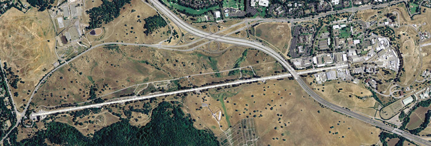

<section data-markdown="">

### PH410 - Electromagnetism

September 16
<!--this doesn't work... -->
</section>

<section data-markdown="">

### For Wednesday
- Griffiths Section 2.4 (pp. 91-97)
- Reading survey

HW3 due Fiday
	
</section>

<section data-markdown>

## Gauss's law

$\oint_S \mathbf{E}\cdot d\mathbf{a}=\frac{Q_{\rm enc}}{\epsilon_0}$

## Divergence theorem

$\oint_S \mathbf{E}\cdot d\mathbf{a}=\int_V\left( \nabla\cdot \mathbf{E}\right) d\tau$

</section>

<section data-markdown>

What is the divergence in the boxed region?

1. Zero
2. Not zero
3. ???

Note:
* CORRECT ANSWER: A
* Lines in; lines out - harder to see dE/dx and dE/dy
* One of those curious ones where the 2D picture might get in the way; think 3D

</section>

<section data-markdown>

We have shown twice that $\nabla \cdot \mathbf{E} = 0$ using what seem to be appropriate vector identities. But physically, $\nabla \cdot \mathbf{E} = \rho/ \varepsilon_0$. What is going on?!

</section>

<section data-markdown>

SLAC (Stanford Linear Accelerator Center) is where quarks (including the charm
quark), and the tauon (like a heavier electron) were discovered.

Note: Charged particles are accelerated inside a long metal cylindrical pipe, which is 2 miles long and has a radius R = 6 cm. All the air is pumped out of this pipe, known as the "beam line."
</section>
<!--

<section data-markdown>

Consider a cube of constant charge density centered at the origin.

**True or False**: I can use Gauss' Law to find the electric field directly above the center of the cube.

1. True and I can argue how we'd do it.
2. True. I'm sure we can, but I don't see how to just yet.
3. False. I'm pretty sure we can't, but I can't say exactly why.
4. False and I can argue why we can't do it.

</section>

<section data-markdown>
Consider a spherical Gaussian surface. What is the $d\mathbf{A}$ in $\int\int\mathbf{E}\cdot d\mathbf{A}$?

1. $r d\theta d\phi \hat{r}$
2. $r^2 d\theta d\phi \hat{r}$
3. $r \sin \theta d\theta d\phi \hat{r}$
4. $r^2 \sin \theta d\theta d\phi \hat{r}$
5. Something else

Note:
* Correct Answer: D
</section>
-->

<section data-markdown>

#### Div of $\mathbf{E}$ contains Guass's Law. What about curl?
Know $\mathbf{E}(\vec{r})=\int_V \frac{\rho(\vec{r^\prime})d\tau^\prime}{|\mathfrak{r}|^2}\hat{\mathfrak{r}}$.

Also, from HW1:
- $\nabla\times\nabla f=0$
- $\nabla\frac{1}{|\mathfrak{r}|}=-\frac{\hat{\mathfrak{r}}}{|\mathfrak{r}|^2}$

</section>
<section data-markdown>

## Electric Potential

</section>

<section data-markdown>

If $\nabla \times \mathbf{E} = 0$, then $\oint_C \mathbf{E} \cdot d\mathbf{l} =$

1. 0
2. something finite
3. $\infty$
4. Can't tell without knowing $C$

Note:
* Correct Answer: A

</section>

<section data-markdown>

Can superposition be applied to electric potential, $V$?

$$V_{tot} \stackrel{?}{=} \sum_i V_i = V_1 +V_2 + V_3 + \dots$$

1. Yes
2. No
3. Sometimes

Note:
* Correct answer: A (usually)
As long as the zero potential is the same for all measurements.

</section>

<section data-markdown>

The potential is zero at some point in space.

You can conclude that:
1. The E-field is zero at that point
2. The E-field is non-zero at that point
3. You can conclude nothing at all about the E-field at that point

Note:
* Correct Answer: C

</section>

<section data-markdown>

The potential is constant everywhere along in some region of space.

You can conclude that:
1. The E-field has a constant magnitude in that space.
2. The E-field is zero in that space.
3. You can conclude nothing at all about the magnitude of $\mathbf{E}$ along that line.

Note:
* Correct Answer: B

</section>
