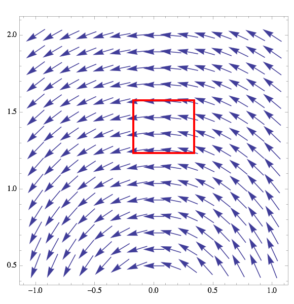
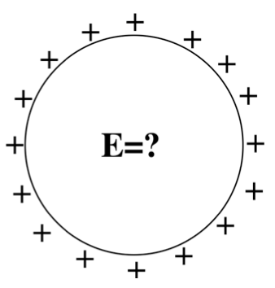

<section data-markdown="">

### PH410 - Electromagnetism

September 18
<!--this doesn't work... -->
</section>

<section data-markdown="">

### For Friday
- Griffiths Section 2.4 (pp. 91-97)
- Reading survey
- HW3 due 
	
</section>

<section data-markdown>

## Gauss's law in integral form...

$\oint_S \mathbf{E}\cdot d\mathbf{a}=\frac{Q_{\rm enc}}{\epsilon_0}$

## ...plus divergence theorem...

$\oint_S \mathbf{E}\cdot d\mathbf{a}=\int_V\left( \nabla\cdot \mathbf{E}\right) d\tau$

## ...Gauss's law in differential form

$\nabla\cdot\mathbf{E}=\rho/\epsilon_0$

</section>

<section data-markdown>

What is the divergence in the boxed region?

1. Zero
2. Not zero
3. ???

Note:
* CORRECT ANSWER: A
* Lines in; lines out - harder to see dE/dx and dE/dy
* One of those curious ones where the 2D picture might get in the way; think 3D

</section>

<section data-markdown>

We have shown twice that $\nabla \cdot \mathbf{E} = 0$ using what seem to be appropriate vector identities. But physically, $\nabla \cdot \mathbf{E} = \rho/ \varepsilon_0$. What is going on?!

</section>

<section data-markdown>

What is the curl of the vector field, $\mathbf{v}= c\hat{\phi}$, in the region shown below?

1. non-zero everywhere
2. zero at some points, non-zero at others
3. zero curl everywhere

Note:
* CORRECT ANSWER: A

</section>

<section data-markdown>

#### Div of $\mathbf{E}$ contains Guass's Law. What about curl?
Know $\mathbf{E}(\vec{r})=k\int_V \frac{\rho(\vec{r^\prime})d\tau^\prime}{|\mathfrak{r}|^2}\hat{\mathfrak{r}}$.

Also, from HW1:
- $\nabla\times\nabla f=0$
- $\nabla\frac{1}{|\mathfrak{r}|}=-\frac{\hat{\mathfrak{r}}}{|\mathfrak{r}|^2}$

</section>
<section data-markdown>

## Electric Potential

</section>
<section data-markdown>

### Stokes

$\int_S\left(\nabla\times\mathbf{E}\right)\cdot d\mathbf{a}=\oint_C\mathbf{E}\cdot d\mathbf{l}$
</section>

<section data-markdown>

If $\nabla \times \mathbf{E} = 0$, then $\oint_C \mathbf{E} \cdot d\mathbf{l} =$

1. 0
2. something finite
3. $\infty$
4. Can't tell without knowing $C$

Note:
* Correct Answer: A

</section>
<section data-markdown>

### If...

$\int_S\left(\nabla\times\mathbf{E}\right)\cdot d\mathbf{a}=\oint_C\mathbf{E}\cdot d\mathbf{l}$

### Then...

$\oint_C\mathbf{E}\cdot d\mathbf{l}=0$

</section>
<section data-markdown>

Can superposition be applied to electric potential, $V$?

$$V_{tot} \stackrel{?}{=} \sum_i V_i = V_1 +V_2 + V_3 + \dots$$

1. Yes
2. No
3. Sometimes

Note:
* Correct answer: A (usually)
As long as the zero potential is the same for all measurements.

</section>

<section data-markdown>

The potential is zero at some point in space.

You can conclude that:
1. The E-field is zero at that point
2. The E-field is non-zero at that point
3. You can conclude nothing at all about the E-field at that point

Note:
* Correct Answer: C

</section>

<section data-markdown>

The potential is constant everywhere in some region of space.

You can conclude that:
1. The E-field has a constant magnitude in that space.
2. The E-field is zero in that space.
3. You can conclude nothing at all about the magnitude of $\mathbf{E}$ along that line.

Note:
* Correct Answer: B

</section>

<section data-markdown>

We are trying to compute the the electric potential $V(\mathbf{r})$ for a line of charge at the location $\langle x,0,z \rangle$. What is $|\mathfrak{R}|$ in this case?

1. $x$
2. $z$
3. $\sqrt{x^2+z^2}$
4. Something else

Note: Correct Answer D (needs to have z')

</section>

<section data-markdown>

We derived the potential for this short rod to be

$V(x,z) = \dfrac{\lambda}{4\pi\varepsilon_0}\log\left[\dfrac{L+z+\sqrt{x^2+(L+z)^2}}{L-z+\sqrt{x^2+(L-z)^2}}\right]$

The associated electric field at $\langle x,0,z\rangle$ location can have the following components:

1. only x
2. only y
3. only z
4. x, y, and z
5. Something else

</section>

<section data-markdown>

A spherical *shell* has a uniform positive charge density on its surface. (There are no other charges around.)

What is the electric field *inside* the sphere?
1. $\mathbf{E}=0$ everywhere inside
2. $\mathbf{E}$ is non-zero everywhere in the sphere
3. $\mathbf{E}=0$ only that the very center, but non-zero elsewhere inside the sphere.
4. Not enough information given

Note:
* Correct Answer: A
</section>

<section data-markdown>

We derived the electric potential outside ($r>R$) the charged shell to be

$$V(r) = \dfrac{1}{4\pi\varepsilon_0}\dfrac{q}{r}$$

What is it for $r<R$?

1. Zero
2. Constant
3. It changes but I don't know how yet
4. Something else

Note:
* Correct Answer: B

</section>

<section data-markdown>

Could this be a plot of $\left|\mathbf{E}(r)\right|$? Or $V(r)$? (for SOME physical situation?)

1. Could be $E(r)$, or $V(r)$
2. Could be $E(r)$, but can't be $V(r)$
3. Can't be $E(r)$, could be $V(r)$
4. Can't be either

Note:
* Correct Answer: B

</section>
