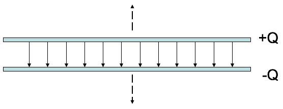
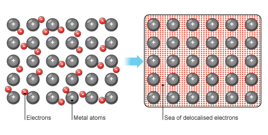
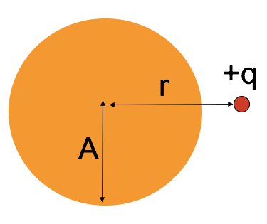
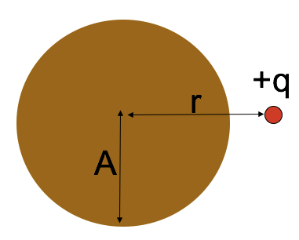
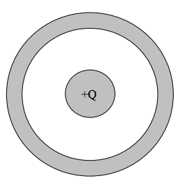
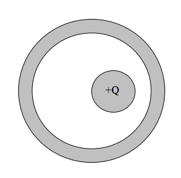
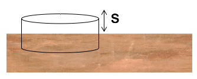
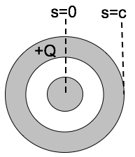

<section data-markdown="">

# DRAFT DRAFT DRAFT

### PH410 - Electromagnetism

September 23
<!--this doesn't work... -->
</section>

<section data-markdown="">

### For *Friday*
- Griffiths Section 3.1
- Reading survey

HW posted, due  Friday 
	
</section>

<section data-markdown>

### Last time, we ended on oundary conditions
</section>
<section data-markdown>

### Electrostatic Potential Energy

</section>

<section data-markdown>

Consider slowly moving a positive charge from a location of low electric potential to one of high electric potential. What is the sign of the work done by you ($W_u$)? What is the sign of the work done by electric field ($W_f$)?

1. $W_u < 0$; $W_f > 0$
2. $W_u < 0$; $W_f < 0$
3. $W_u > 0$; $W_f > 0$
4. $W_u > 0$; $W_f < 0$

Note: Correct Answer is D; Draw field

</section>

<section data-markdown>

Three identical charges $+q$ sit on an equilateral triangle. What would be the final $KE$ of the top charge if you released it (keeping the other two fixed)?

1. $\frac{1}{4\pi\varepsilon_0}\frac{q^2}{a}$
2. $\frac{1}{4\pi\varepsilon_0}\frac{2q^2}{3a}$
3. $\frac{1}{4\pi\varepsilon_0}\frac{2q^2}{a}$
4. $\frac{1}{4\pi\varepsilon_0}\frac{3q^2}{a}$
5. Other

Note:
CORRECT ANSWER: C

</section>

<section data-markdown>

Three identical charges $+q$ sit on an equilateral triangle. What would be the final $KE$ of the top charge if you released *all three*?

1. $\frac{1}{4\pi\varepsilon_0}\frac{q^2}{a}$
2. $\frac{1}{4\pi\varepsilon_0}\frac{2q^2}{3a}$
3. $\frac{1}{4\pi\varepsilon_0}\frac{2q^2}{a}$
4. $\frac{1}{4\pi\varepsilon_0}\frac{3q^2}{a}$
5. Other

Note:
CORRECT ANSWER: A

</section>

<section data-markdown>

Does system energy "superpose"?

That is, if you have one system of charges with total stored energy $W_1$, and a second charge distribution with $W_2$...if you superpose these charge distributions, is the total energy of the new system simply $W_1 + W_2$?

1. Yes
2. No

Note:
* CORRECT ANSWER: B
* Draw 4 charges and show that it is not the sum of the 2 charges and the other 2.

</section>
<section data-markdown>

Two charges, $+q$ and $-q$, are a distance $r$ apart.  As the charges are slowly moved together, the total field energy

$$\dfrac{\varepsilon_0}{2}\int E^2 d\tau$$

1. increases
2. decreases
3. remains constant

Note:
* CORRECT ANSWER: B
* Consider when they overlap, field goes to zero, must be E gets smaller as they get closer. same volume
</section>

<section data-markdown>

A parallel-plate capacitor has $+Q$ on one plate, $-Q$ on the other.  The plates are isolated so the charge $Q$ cannot change.  As the plates are pulled apart, the total electrostatic energy stored in the capacitor:

1. increases
2. decreases
3. remains constant.

<section data-markdown>

### Conductors

</section>

<section data-markdown>

### The conductor problem

</section>
Note:
* CORRECT ANSWER: A
* Same E; constant; larger volume where it is non-zero
</section>

<section data-markdown>

A typical metal has one free election per atom. These electrons are free to move in response to external electric fields. There are $\sim 10^{22}$ free electrons in a cubic centimeter of copper. Roughly what size of electric field could a single 1cm sub of copper "respond" to by polarizing?

1. 1 N/C
2. 10 N/C
3. 100 N/C
4. 1000 N/C
5. Something more than these

Note: Correct answer is E. It's closer to 10e17 N/C

</section>

<section data-markdown>

A point charge $+q$ sits outside a **solid neutral conducting copper sphere** of radius $A$. The charge q is a distance $r > A$ from the center, on the right side. What is the E-field at the center of the sphere? (Assume equilibrium situation).

1. $|E| = kq/r^2$, to left
2. $kq/r^2 > |E| > 0$, to left
3. $|E| > 0$, to right
4. $E = 0$
5. None of these

Note:
* CORRECT ANSWER: D
* Net electric field inside of a metal in static equilibrium is zero
* Talk about the net field versus the field due to the charges on the metal.

</section>

<section data-markdown>

In the previous question, suppose **the copper sphere is charged**, total charge $+Q$. (We are still in static equilibrium.) What is now the magnitude of the E-field at the center of the sphere?

1. $|E| = kq/r^2$
2. $|E| = kQ/A^2$
3. $|E| = k(q-Q)/r^2$
4. $|E| = 0$
5. None of these! / it’s hard to compute

Note:
* CORRECT ANSWER: D
* Talk about the net field versus the field due to the charges on the metal.
</section>

<section data-markdown>

Consider a long coaxial with charge $+Q$ placed on the inside metal wire and $-Q$ outside metal sheath as shown.

Sketch the distribution of charge in this situtation using plus signs to represent positive chages and minus signs to represent negative charges.

Note:
* Ask them for answers, put up on board and turn into clicker question
* Answer should be plusses on outside of inner and minuses inside of outer (equal numbers)

</section>

<section data-markdown>

If you were calculating the potential difference, $\Delta V$, between the center of the inner conductor ($s=0$) and infinitely far away ($s \rightarrow \infty$), what regions of space would have a (non-zero) contribution to your calculation?

1. $s<a$
2. $a<s<b$
3. $b<s<c$
4. $s>c$
5. More than one of these

Note:
* Correct answer: E
* Should be where the metal is

</section>

<section data-markdown>
	

Now, draw the charge distribution (little + and – signs) if the inner conductor has a total charge $+Q$ on it, and the outer conductor is electrically neutral.

Note:
* Ask them for answers, put up on board and turn into clicker question
* Answer should be plusses on outside of inner and minuses inside of outer and plusses on outside of outer (equal numbers)

</section>

<section data-markdown>

Consider how the charge distribution would change if the inner conductor is shifted off-center, but still has $+Q$ on it, and the outer conductor remains electrically neutral. Draw the new charge distribution (little + and – signs) and be precise about how you know.

Note:
* Ask them for answers, put up on board and turn into clicker question
* Answer should be plusses on outside of inner and minuses inside of outer and plusses on outside of outer (equal numbers); shift only on outside of inner and inside of outer (no net field from them)

</section>

<section data-markdown>

Return the inner conductor to the center.

Instead of the total charge $+Q$ being on the inner conductor, sketch the charge distribution (little + and – signs) if the outer conductor has a total charge $+Q$ on it, and the inner conductor is electrically neutral. Be precise about exactly where the charge will be on these conductors, and how you know.

Note:
* Ask them for answers, put up on board and turn into clicker question
* Answer should be plusses on outside of outer; nothing else.

</section>
<section data-markdown>

We have a large copper plate with uniform surface charge density, $\sigma$.
Imagine the Gaussian surface drawn below.  Calculate the E-field a small distance $s$ above the conductor surface.

1. $|E| = \frac{\sigma}{\varepsilon_0}$
2. $|E| = \frac{\sigma}{2\varepsilon_0}$
3. $|E| = \frac{\sigma}{4\varepsilon_0}$
4. $|E| = \frac{1}{4\pi\varepsilon_0}\frac{\sigma}{s^2}$
5. $|E| = 0$

Note:
* CORRECT ANSWER: A
* Might have to do derivation and go through details of infinitely thin line charge. Must be +sigma on other side, btw.

</section>

<section data-markdown>

A positive charge ($q$) is outside a metal conductor with a hole cut out of it at a distance $a$ from the center of the hole. What is the *net* electric field at center of the hole?

1. $\dfrac{1}{4 \pi \varepsilon_0}\dfrac{q}{a^2}$
2. $\dfrac{-1}{4 \pi \varepsilon_0}\dfrac{q}{a^2}$
3. $\dfrac{1}{4 \pi \varepsilon_0}\dfrac{2q}{a^2}$
4. $\dfrac{-1}{4 \pi \varepsilon_0}\dfrac{2q}{a^2}$
5. Zero

Note: Correct Answer E
</section>

<section data-markdown>

With $\nabla \times \mathbf{E} = 0$, we know that,

$$\oint \mathbf{E} \cdot d\mathbf{l} = 0$$

If we choose a loop that includes a metal and interior vacuum (i.e., both in and **inside the hole**), we know that the contribution to this integral in the metal vanishes. What can we say about the contribution in the hole?

1. It vanishes also
2. $\mathbf{E}$ must be zero in there
3. $\mathbf{E}$ must be perpendicular to d$\mathbf{l}$ everywhere
4. $\mathbf{E}$ is perpendicular to the metal surface
5. More than one of these

Note:
* Correct answer: E (A and B)

</section>

<section data-markdown>

With $\nabla \times \mathbf{E} = 0$, we know that,

$$\oint \mathbf{E} \cdot d\mathbf{l} = 0$$

If we choose a loop that includes a metal and vacuum (i.e., both in and **just outside of the metal**), we know that the contribution to this integral in the metal vanishes. What can we say about the contribution just outside the metal?

1. It vanishes also
2. $\mathbf{E}$ must be zero out there
3. $\mathbf{E}$ must be perpendicular to d$\mathbf{l}$ everywhere
4. $\mathbf{E}$ is perpendicular to the metal surface
5. More than one of these

Note:
* Correct answer: E (both A and D)

</section>

<section data-markdown>

A neutral copper sphere has a spherical hollow in the center.  A charge $+q$ is placed in the center of the hollow.  What is the total charge on the outside surface of the copper sphere? (Assume Electrostatic equilibrium.)

1. Zero
2. $-q$
3. $+q$
4. $0 < q_{outer} < +q$
5. $-q < q_{outer} < 0$

Note:
* Correct answer: C

</section>

<section data-markdown>

A long coax has total charge $+Q$ on the OUTER conductor. The INNER conductor is neutral.

What is the sign of the potential difference, $\Delta V = V(c)-V(0)$, between the center of the inner conductor ($s = 0$)
and the outside of the outer conductor?

1. Positive
2. Negative
3. Zero

Note:
* CORRECT ANSWER: C; there's no field inside at all

</section>

<section data-markdown>

Given a pair of very large, flat, conducting capacitor plates with total charges $+Q$ and $-Q$. Ignoring edges, what is the equilibrium distribution of the charge?

1. Throughout each plate
2. Uniformly on both side of each plate
3. Uniformly on top of $+Q$ plate and bottom of $–Q$ plate
4. Uniformly on bottom of $+Q$ plate and top of $–Q$ plate
5. Something else

Note:
* CORRECT ANSWER: D

</section>

<section data-markdown>

Given a pair of very large, flat, conducting capacitor plates with surface charge densities $+/-\sigma$, what is the E field in the region between the plates?

1. $\sigma/2\varepsilon_0$
2. $\sigma/\varepsilon_0$
3. $2\sigma/\varepsilon_0$
4. $4\sigma/\varepsilon_0$
5. Something else

Note:
* CORRECT ANSWER: B

</section>

<section data-markdown>

The eletric field between the shells is just that of a point charge. What is the electric potential difference between the outer shell ($r=b$) and the inner shell ($r=a$)?

1. $\dfrac{Q}{4\pi\varepsilon_0}\left(\dfrac{1}{b}-\dfrac{1}{a}\right)$
2. $\dfrac{Q}{4\pi\varepsilon_0}\left(\dfrac{1}{a}-\dfrac{1}{b}\right)$
3. $\dfrac{Q}{4\pi\varepsilon_0}\left(\dfrac{1}{b^2}-\dfrac{1}{a^2}\right)$
4. $\dfrac{Q}{4\pi\varepsilon_0}\left(\dfrac{1}{a^2}-\dfrac{1}{b^2}\right)$
5. Something else?

Note: Correct Answer is B
</section>

<section data-markdown>

What is the sign of the potential difference between the outer shell ($r=b$) and the inner shell ($r=a$)?

$\Delta V = V(b) - V(a)$

1. $\Delta V > 0$
2. $\Delta V < 0$
2. ???

Note: Correct Answer is A

</section>

<section data-markdown>

You have two very large parallel plate capacitors, both with the same area and the same charge $Q$.
Capacitor \#1 has twice the gap of Capacitor \#2. Which has more stored potential energy?

1. \#1 has twice the stored energy
2. \#1 has more than twice
3. They both have the same
4. \#2 has twice the stored energy
5. \#2 has more than twice.

Note:
* CORRECT ANSWER: A
* E same; twice volume

</section>

<section data-markdown>

A parallel plate capacitor is attached to a battery which maintains a constant voltage difference V between the capacitor plates.  While the battery is attached, the plates are pulled apart. The electrostatic energy stored in the capacitor

1. increases.
2. decreases.
3. stays constant.

Note:
* CORRECT ANSWER: B
* Potential same; field is reduced; but shows up squared while d is increased, overall goes down
</section>
