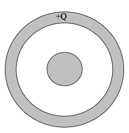
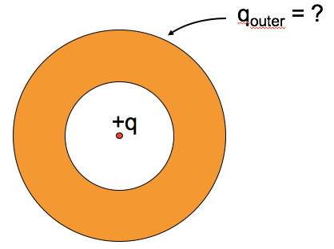
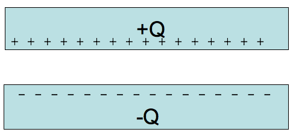
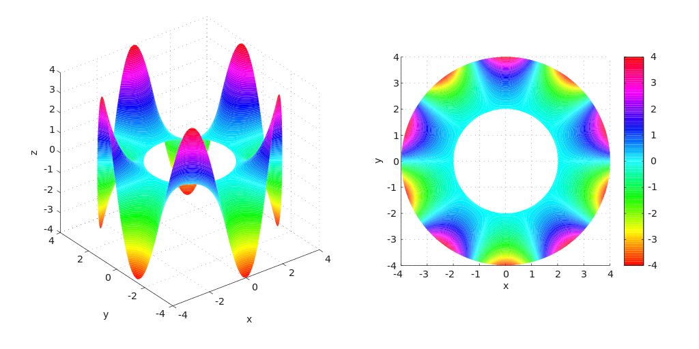

<section data-markdown="">

### PH410 - Electromagnetism

September 27
<!--this doesn't work... -->
</section>

<section data-markdown="">

### For Monday
- Griffiths Section 3.1
- Reading survey

HW posted, due  Friday 

#### Exam 1 is Oct 7
	
</section>

<section data-markdown>

Consider how the charge distribution would change if the inner conductor is shifted off-center, but still has $+Q$ on it, and the outer conductor remains electrically neutral. Draw the new charge distribution (little + and – signs) and be precise about how you know.

Note:
* Ask them for answers, put up on board and turn into clicker question
* Answer should be plusses on outside of inner and minuses inside of outer and plusses on outside of outer (equal numbers); shift only on outside of inner and inside of outer (no net field from them)

</section>

<section data-markdown>

Return the inner conductor to the center.

Instead of the total charge $+Q$ being on the inner conductor, sketch the charge distribution (little + and – signs) if the outer conductor has a total charge $+Q$ on it, and the inner conductor is electrically neutral. Be precise about exactly where the charge will be on these conductors, and how you know.

Note:
* Ask them for answers, put up on board and turn into clicker question
* Answer should be plusses on outside of outer; nothing else.

</section>
<!--

<section data-markdown>

A positive charge ($q$) is outside a metal conductor with a hole cut out of it at a distance $a$ from the center of the hole. What is the *net* electric field at center of the hole?

1. $\dfrac{1}{4 \pi \varepsilon_0}\dfrac{q}{a^2}$
2. $\dfrac{-1}{4 \pi \varepsilon_0}\dfrac{q}{a^2}$
3. $\dfrac{1}{4 \pi \varepsilon_0}\dfrac{2q}{a^2}$
4. $\dfrac{-1}{4 \pi \varepsilon_0}\dfrac{2q}{a^2}$
5. Zero

Note: Correct Answer E
</section>

<section data-markdown>

With $\nabla \times \mathbf{E} = 0$, we know that,

$$\oint \mathbf{E} \cdot d\mathbf{l} = 0$$

If we choose a loop that includes a metal and interior vacuum (i.e., both in and **inside the hole**), we know that the contribution to this integral in the metal vanishes. What can we say about the contribution in the hole?

1. It vanishes also
2. $\mathbf{E}$ must be zero in there
3. $\mathbf{E}$ must be perpendicular to d$\mathbf{l}$ everywhere
4. $\mathbf{E}$ is perpendicular to the metal surface
5. More than one of these

Note:
* Correct answer: E (A and B)

</section>

<section data-markdown>

With $\nabla \times \mathbf{E} = 0$, we know that,

$$\oint \mathbf{E} \cdot d\mathbf{l} = 0$$

If we choose a loop that includes a metal and vacuum (i.e., both in and **just outside of the metal**), we know that the contribution to this integral in the metal vanishes. What can we say about the contribution just outside the metal?

1. It vanishes also
2. $\mathbf{E}$ must be zero out there
3. $\mathbf{E}$ must be perpendicular to d$\mathbf{l}$ everywhere
4. $\mathbf{E}$ is perpendicular to the metal surface
5. More than one of these

Note:
* Correct answer: E (both A and D)

</section>
-->
<section data-markdown>

A neutral copper sphere has a spherical hollow in the center.  A charge $+q$ is placed in the center of the hollow.  What is the total charge on the outside surface of the copper sphere? (Assume Electrostatic equilibrium.)

1. Zero
2. $-q$
3. $+q$
4. $0 < q_{outer} < +q$
5. $-q < q_{outer} < 0$

Note:
* Correct answer: C

</section>

<section data-markdown>

A long coax has total charge $+Q$ on the OUTER conductor. The INNER conductor is neutral.

What is the sign of the potential difference, $\Delta V = V(c)-V(0)$, between the center of the inner conductor ($s = 0$)
and the outside of the outer conductor?

1. Positive
2. Negative
3. Zero

Note:
* CORRECT ANSWER: C; there's no field inside at all

</section>

<section data-markdown>

Given a pair of very large, flat, conducting capacitor plates with total charges $+Q$ and $-Q$. Ignoring edges, what is the equilibrium distribution of the charge?

1. Throughout each plate
2. Uniformly on both side of each plate
3. Uniformly on top of $+Q$ plate and bottom of $–Q$ plate
4. Uniformly on bottom of $+Q$ plate and top of $–Q$ plate
5. Something else

Note:
* CORRECT ANSWER: D

</section>

<section data-markdown>

Given a pair of very large, flat, conducting capacitor plates with surface charge densities $+/-\sigma$, what is the E field in the region between the plates?

1. $\sigma/2\varepsilon_0$
2. $\sigma/\varepsilon_0$
3. $2\sigma/\varepsilon_0$
4. $4\sigma/\varepsilon_0$
5. Something else

Note:
* CORRECT ANSWER: B

</section>
<!--
<section data-markdown>

The eletric field between the shells is just that of a point charge. What is the electric potential difference between the outer shell ($r=b$) and the inner shell ($r=a$)?

1. $\dfrac{Q}{4\pi\varepsilon_0}\left(\dfrac{1}{b}-\dfrac{1}{a}\right)$
2. $\dfrac{Q}{4\pi\varepsilon_0}\left(\dfrac{1}{a}-\dfrac{1}{b}\right)$
3. $\dfrac{Q}{4\pi\varepsilon_0}\left(\dfrac{1}{b^2}-\dfrac{1}{a^2}\right)$
4. $\dfrac{Q}{4\pi\varepsilon_0}\left(\dfrac{1}{a^2}-\dfrac{1}{b^2}\right)$
5. Something else?

Note: Correct Answer is B
</section>

<section data-markdown>

What is the sign of the potential difference between the outer shell ($r=b$) and the inner shell ($r=a$)?

$\Delta V = V(b) - V(a)$

1. $\Delta V > 0$
2. $\Delta V < 0$
2. ???

Note: Correct Answer is A

</section>
-->
<section data-markdown>

You have two very large parallel plate capacitors, both with the same area and the same charge $Q$.
Capacitor \#1 has twice the gap of Capacitor \#2. Which has more stored potential energy?

1. \#1 has twice the stored energy
2. \#1 has more than twice
3. They both have the same
4. \#2 has twice the stored energy
5. \#2 has more than twice.

Note:
* CORRECT ANSWER: A
* E same; twice volume

</section>

<section data-markdown>

A parallel plate capacitor is attached to a battery which maintains a constant voltage difference V between the capacitor plates.  While the battery is attached, the plates are pulled apart. The electrostatic energy stored in the capacitor

1. increases.
2. decreases.
3. stays constant.

Note:
* CORRECT ANSWER: B
* Potential same; field is reduced; but shows up squared while d is increased, overall goes down
</section>

<section data-markdown>

### Laplace's Equation

</section>

<section data-markdown>

A region of space contains no charges. What can I say about $V$ in the interior?

1. Not much, there are lots of possibilities for $V(r)$ in there
2. $V(r)=0$ everywhere in the interior.
3. $V(r)=$constant everywhere in the interior

Note:
* CORRECT ANSWER: A

</section>

<section data-markdown>

A region of space contains no charges. The boundary has V=0 everywhere.
What can I say about $V$ in the interior?

1. Not much, there are lots of possibilities for $V(r)$ in there
2. $V(r)=0$ everywhere in the interior.
3. $V(r)=$constant everywhere in the interior

Note:
* CORRECT ANSWER: B

</section>
