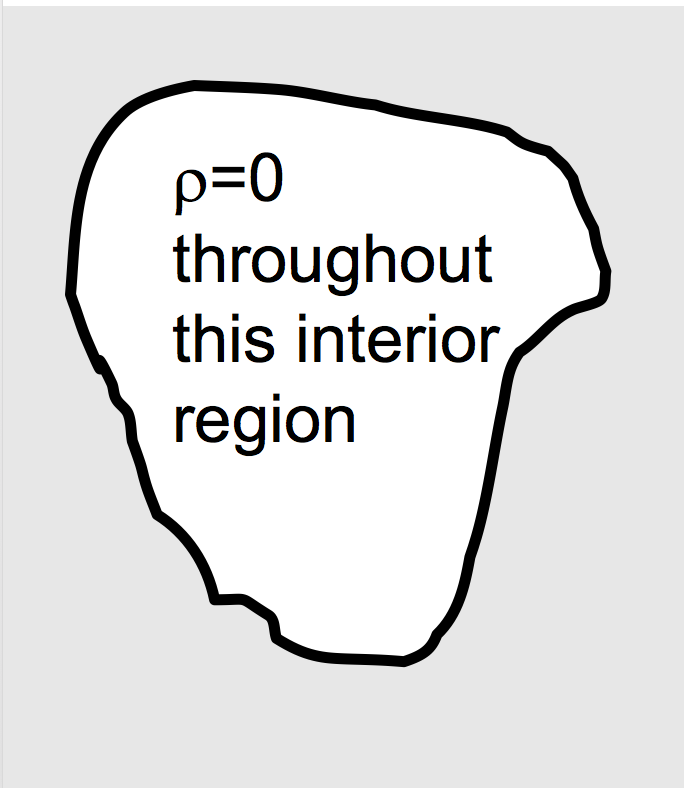
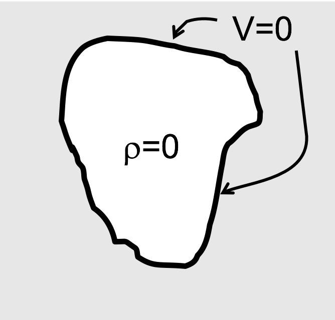
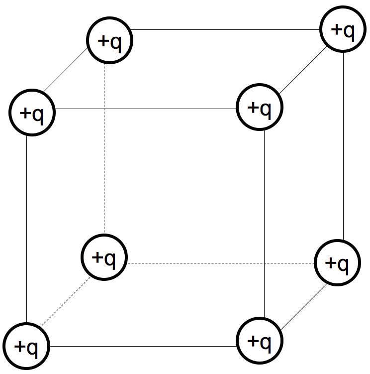

 
<section data-markdown="">

### PH410 - Electromagnetism

September 30
<!--this doesn't work... -->
</section>

<section data-markdown="">

### For Wednesday
- Griffiths Section 3.2
- Reading survey

HW posted tomorrow, due  Friday 

#### Exam 1 is Oct 7
	
</section>

<section data-markdown>

### Laplace's Equation

</section>

<section data-markdown>

A region of space contains no charges. What can I say about $V$ in the interior?

1. Not much, there are lots of possibilities for $V(r)$ in there
2. $V(r)=0$ everywhere in the interior.
3. $V(r)=$constant everywhere in the interior

Note:
* CORRECT ANSWER: A

</section>
<section data-markdown>

### Summary of properties w/o proof

- $V$ has no local min/max except on boundaries
- $V$ is smooth and continuous everywhere
- $V$ at a location is equal to the average over any surrounding sphere: $V(\vec{r})=\iint_{sphere} Vda$
- $V$ is unique if you know boundary conditions
</section>

<section data-markdown>

A region of space contains no charges. The boundary has V=0 everywhere.
What can I say about $V$ in the interior?

1. Not much, there are lots of possibilities for $V(r)$ in there
2. $V(r)=0$ everywhere in the interior.
3. $V(r)=$constant everywhere in the interior

Note:
* CORRECT ANSWER: B

</section>

<section data-markdown>

For the 1D Laplace problem ($\nabla^2 V = \partial^2 V/\partial x^2 = 0$), we can choose the following ansatz:

1. $k_0\,x$
2. $k_0\,x+k_1$
3. $k_0\,x^2+k_1\,x+k_2$
4. Can't tell

</section>

<section data-markdown>

If you put a positive test charge at the center of this cube of charges, could it be in stable equilibrium?

1. Yes
2. No
3. ???

Note:
* CORRECT ANSWER: B

</section>

<section data-markdown>
Griffiths, in a minor parenthetical aside: "This, incidentally, suggests the method of relaxation, on which computer solutions to Laplace's equation are based..."

You know what this means, right?
</section>

<!--
<section data-markdown>

### Method of Relaxation

</section>

<section data-markdown>

Consider a function $f(x)$ that is both continuous and continuously differentiable over some domain. Given a step size of $a$, which could be an approximate derivative of this function somewhere in that domain? $df/dx \approx$

1. $f(x_i+a) - f(x_i)$
2. $f(x_i) - f(x_i-a)$
3. $\frac{f(x_i+a) - f(x_i)}{a}$
4. $\frac{f(x_i) - f(x_i-a)}{a}$
5. More than one of these

Note:
* Correct Answer: E (C and D)
</section>

<section data-markdown>
If we choose to use:

$$\dfrac{df}{dx} \approx \dfrac{f(x_i+a) - f(x_i)}{a}$$

Where are we computing the approximate derivative?

1. $a$
2. $x_i$
3. $x_i + a$
4. Somewhere else

Note:
* Correct Answer: D (it's halfway between)

</section>

<section data-markdown>

Taking the second derivative of $f(x)$ discretely is as simple as applying the discrete definition of the derivative,

$$f''(x_i) \approx \dfrac{f'(x_i + a/2) - f'(x_i - a/2)}{a}$$

Derive the second derivative in terms of $f$.

</section>

<section data-markdown>

With the approximate form of Laplace's equation:

$\dfrac{V(x_i+a) - 2V(x_i) + V(x_i-a)}{a} \approx 0$

What is a the appropriate estimate of $V(x_i)$?

1. ${1}/{2}(V(x_i+a)-V(x_i-a))$
2. ${1}/{2}(V(x_i+a)+V(x_i-a))$
3. ${a}/{2}(V(x_i+a)-V(x_i-a))$
4. ${a}/{2}(V(x_i+a)+V(x_i-a))$
5. Something else

Note:
* Correct answer: B

</section>

<section data-markdown>

To investigate the convergence, we must compare the estimate of $V$ before and after each calculation. For our 1D relaxation code, $V$ will be a 1D array. For the kth estimate, we can compare $V_k$ against its previous value by simply taking the difference.

Store this in a variable called ``err``. What is the type for ``err``?

1. A single number
2. A 1D array
3. A 2D array
4. ???

Note:
* Correct Answer: B

</section>

<section data-markdown>

The Method of Relaxation also works for Poisson's equation (i.e., when there is charge!).

Given, $\nabla^2 V \approx \dfrac{V(x+a)-2V(x)+V(x-a)}{a^2}$

Which equations describes the appropriate "averaging" that we must do:

1. $V(x) = \dfrac{1}{2}(V(x+a)-V(x-a))$
2. $V(x) = \dfrac{\rho(x)}{\varepsilon_0}+\dfrac{1}{2}(V(x+a)+V(x-a))$
3. $V(x) = \dfrac{a^2\rho(x)}{2\varepsilon_0}+\dfrac{1}{2}(V(x+a)+V(x-a))$

Note:
* Correct answer: C

</section>
-->
