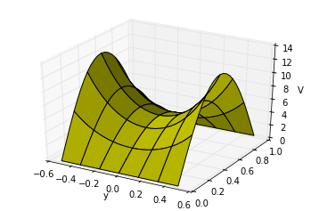

 
<section data-markdown="">

### PH410 - Electromagnetism

October 9
<!--this doesn't work... -->
</section>

<section data-markdown="">

#### Exam 1 is Monday, Oct 7
	
</section>

<section data-markdown>

When does $\sin(ka)e^{-ky}$ vanish?

1. $k = 0$
2. $k = \pi/(2a)$
3. $k = \pi/a$
4. A and C
5. A, B, C

Note:
* CORRECT ANSWER: D
* It's actuall n*pi/a

</section>

<section data-markdown>

Suppose $V_1(r)$ and $V_2(r)$ are linearly independent functions which both solve Laplace's equation, $\nabla^2 V = 0$.

Does $aV_1(r)+bV_2(r)$ also solve it (with $a$ and $b$ constants)?

1. Yes. The Laplacian is a linear operator
2. No. The uniqueness theorem says this scenario is impossible, there are never two independent solutions!
3. It is a definite yes or no, but the reasons given above just aren't right!
4. It depends...

Note:
* CORRECT ANSWER: A

</section>

<section data-markdown>

What is the value of $\int_0^{a} \sin(n\pi x/a)\sin(m\pi x/a)\;dx$ ?

1. Zero
2. Non-zero
5. Depends on $n$ and $m$

Note:
* CORRECT ANSWER: C
* If n = m then integral is non-zero

</section>

<section data-markdown>

### Exact Solutions:

$$V(x,y) = \sum_{n=1}^{\infty} \dfrac{4V_0}{n\pi}\dfrac{1}{\cosh\left(\frac{n\pi}{2}\right)}\cosh\left(\frac{n\pi x}{a}\right)\sin\left(\frac{n \pi y}{a}\right)$$

### Approximate Solutions:
### (1 term; 20 terms)

</section>

<section data-markdown>

Given $\nabla^2 V = 0$ in Cartesian coords, we separated $V(x,y,z) = X(x)Y(y)Z(z)$. Will this approach work in spherical coordinates, i.e. can we separate $V(r,\theta,\phi) = R(r)\Theta(\theta)\Phi(\phi)$?

1. Sure.
2. Not quite - the angular components cannot be isolated, e.g., $f(r,\theta,\phi) = R(r)Y(\theta,\phi)$
3. It won't work at all because the spherical form of Laplace's Equation has cross terms in it (see the front cover of Griffiths)

Note:
* CORRECT ANSWER: A

</section>
