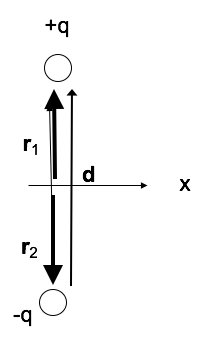
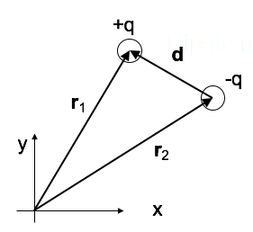
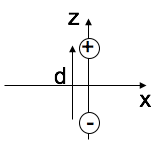
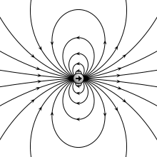
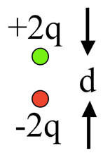
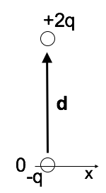
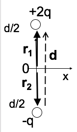
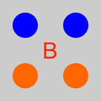

<section data-markdown="">

### PH410 - Electromagnetism

October 21

#### For Wednesday, read section 4.1

<!--this doesn't work... -->
</section>

<section data-markdown>

## Multipole Expansion

Multipole Expansion of the Power Spectrum of CMBR

Note: The radiation from cosmic microwave background can be described in terms of contributions using a basis of functions with increasing smaller contributions.

</section>

<section data-markdown>

Two charges are positioned as shown to the left. The relative position vector between them is $\mathbf{d}$. What is the value of of the dipole moment? $\sum_i q_i \mathbf{r}_i$

1. $+q\mathbf{d}$
2. $-q\mathbf{d}$
3. Zero
4. None of these

Note:
* CORRECT ANSWER: A

</section>

<section data-markdown>

Two charges are positioned as shown to the left. The relative position vector between them is $\mathbf{d}$. What is the dipole moment of this configuration?

$$\sum_i q_i \mathbf{r}_i$$

1. $+q\mathbf{d}$
2. $-q\mathbf{d}$
3. Zero
4. None of these; it's more complicated than before!

Note:
* CORRECT ANSWER: A

</section>
<section data-markdown>
  $$R_\pm=\sqrt{x^2+y^2+\left(z\mp d/2\right)^2}$$
  $$R_\pm=\sqrt{x^2+y^2+\left(z^2+d^2/4\mp dz\right)}$$
  $$R_\pm=\sqrt{\left(x^2+y^2+z^2\right)\mp dz+d^2/4}=\sqrt{r^2\mp dz+d^2/4}$$
  $$R_\pm=r\sqrt{1\mp \frac{dz}{r^2}+\frac{d^2}{4r^2}}$$

</section>

<section data-markdown>

For a dipole at the origin pointing in the z-direction, we have derived:

$$\mathbf{E}_{dip}(\mathbf{r}) = \dfrac{p}{4 \pi \varepsilon_0 r^3}\left(2 \cos \theta\hat{\mathbf{r}} + \sin \theta\hat{\mathbf{\theta}}\right)$$

For the dipole $\mathbf{p} = q\mathbf{d}$ shown, what does the formula predict for the direction of $\mathbf{E}(\mathbf{r}=0)$?

1. Down
2. Up
3. Some other direction
4. The formula doesn't apply

Note:
* CORRECT ANSWER: D
* The formula works far from the dipole only.

</section>

<section data-markdown>

### Ideal vs. Real dipole

</section>

<section data-markdown>

**True or False**: The electric potential of a pure dipole is given exactly by:

$$V(r) = \dfrac{\mathbf{p}\cdot\mathbf{r}}{4 \pi\varepsilon_0 r^3}$$

1. True
2. False

</section>

<section data-markdown>

$$\mathbf{p} = \sum_i q_i \mathbf{r}_i$$

What is the magnitude of the dipole moment of this charge distribution?

1. qd
2. 2qd
3. 3qd
4. 4qd
5. It's not determined

Note:
* CORRECT ANSWER: B

</section>

<section data-markdown>

$$\mathbf{p} = \sum_i q_i \mathbf{r}_i$$

What is the dipole moment of this system?

(BTW, it is NOT overall neutral!)

1. $q\mathbf{d}$
2. $2q\mathbf{d}$
3. $\frac{3}{2}q\mathbf{d}$
4. $3q\mathbf{d}$
5. Someting else (or not defined)

Note:
* CORRECT ANSWER: B

</section>

<section data-markdown>

$$\mathbf{p} = \sum_i q_i \mathbf{r}_i$$

What is the dipole moment of this system?

(Same as last question, just shifted in $z$.)

1. $q\mathbf{d}$
2. $2q\mathbf{d}$
3. $\frac{3}{2}q\mathbf{d}$
4. $3q\mathbf{d}$
5. Someting else (or not defined)

Note:
* CORRECT ANSWER: C

</section>

<section data-markdown>

You have a physical dipole, $+q$ and $-q$ a finite distance $d$ apart. When can you use the expression:

$$V(\mathbf{r}) = \dfrac{1}{4 \pi \varepsilon_0}\dfrac{\mathbf{p}\cdot \hat{\mathbf{r}}}{r^2}$$

1. This is an exact expression everywhere.
2. It's valid for large $r$
3. It's valid for small $r$
4. No idea...

Note:
* CORRECT ANSWER: B

</section>

<section data-markdown>

You have a physical dipole, $+q$ and $-q$ a finite distance $d$ apart. When can you use the expression:

$$V(\mathbf{r}) = \dfrac{1}{4 \pi \varepsilon_0}\sum_i \dfrac{q_i}{\mathfrak{R}_i}$$

1. This is an exact expression everywhere.
2. It's valid for large $r$
3. It's valid for small $r$
4. No idea...

Note:
* CORRECT ANSWER: A

</section>

<section data-markdown>

Which charge distributions below produce a potential that looks like $\frac{C}{r^2}$ when you are far away?

E) None of these, or more than one of these!

(For any which you did not select, how DO they behave at large r?)

Note:
* CORRECT ANSWER: E (Both C and D)

</section>

<section data-markdown>

Which charge distributions below produce a potential that looks like $\frac{C}{r^2}$ when you are far away?

E) None of these, or more than one of these!

(For any which you did not select, how DO they behave at large r?)

Note:
* CORRECT ANSWER: E (Both B and D)

</section>

<section data-markdown>

In terms of the multipole expansion $V(r) = V(mono) + V(dip) + V(quad) + \dots$, the following charge distribution has the form:

1. $V(r) = V(mono) + V(dip) +\;$ higher order terms
2. $V(r) = V(dip) +\;$ higher order terms
3. $V(r) = V(dip)$
4. $V(r) =\;$ only higher order terms than dipole
5. No higher terms, $V(r) = 0$ for this one.

Note:
* CORRECT ANSWER: D

</section>
<!--
<section data-markdown>

Which of the following distributions could have a dipole contribution to the potential far from the charges?

D. None

E. More than one!

Note:
* CORRECT ANSWER: E
* We didn't specify where the origin!

</section>

<section data-markdown>

In which situation is the dipole term the leading non-zero contribution to the potential?

1. 1 and 3
2. 2 and 4
3. only 5
4. 1 and 5
5. Some other combo

Note:
* CORRECT ANSWER: D

</section>

<section data-markdown>

Consider a single point charge at the origin. It will have ONLY a monopole contribution to the potential at a location $\mathbf{r} = \langle x,y,z\rangle$.

As we have seen, if we move the charge to another location (e.g., $\mathbf{r}' = \langle 0,0,d \rangle$), the distribution now has a dipole contribution to the potential at $\mathbf{r}$!

What the hell is going on here?

1. It's just how the math works out. Nothing has changed physically at $\mathbf{r}$.
2. There is something different about the field at $\mathbf{r}$ and the potential is showing us that.
3. I'm not sure how to resolve this problem.

</section>
-->
