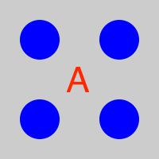
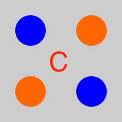
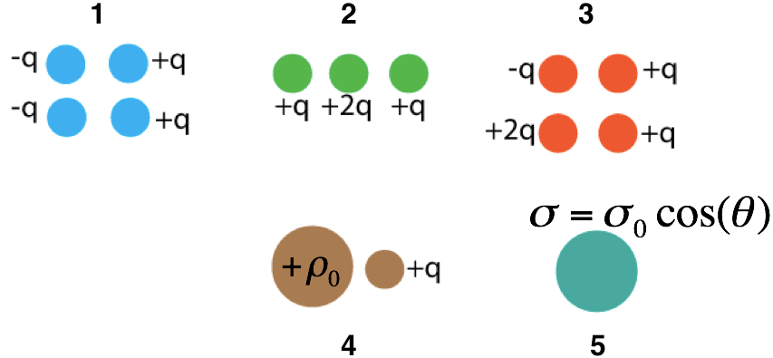
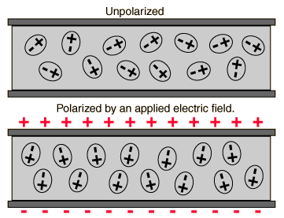
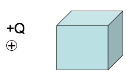
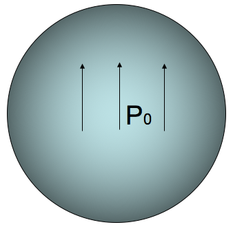
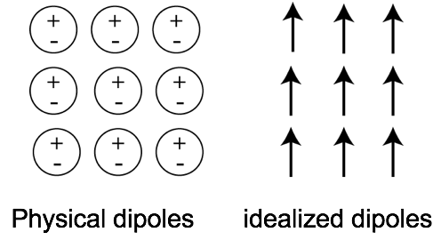
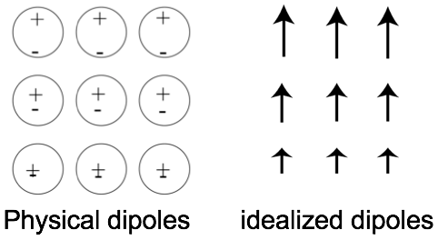

<section data-markdown="">

### PH410 - Electromagnetism

October 23

#### For Friday, read section 4.2 and 4.3

<!--this doesn't work... -->
</section>

<section data-markdown>
Law of cosines: $\mathfrak{r}^2=r^2+{r^\prime}^2-2rr^\prime \cos\theta^\prime=r^2\left(1+\frac{{{r^\prime}^2}}{r^2}-\frac{2r^\prime}{r}\cos\theta^\prime\right)$
  
If $\epsilon\equiv r^\prime/r$:
$$\mathfrak{r}=r\sqrt{1-2\epsilon\cos\theta^\prime+\epsilon^2}$$
$$\frac{1}{\mathfrak{r}}=\frac{1}{r}\left(1-2\epsilon\cos\theta^\prime+\epsilon^2\right)^{-1/2}$$

</section>

<section data-markdown>

Which charge distributions below produce a potential that looks like $\frac{C}{r^2}$ when you are far away?

E) None of these, or more than one of these!

(For any which you did not select, how DO they behave at large r?)

Note:
* CORRECT ANSWER: E (Both C and D)

</section>

<section data-markdown>

Which charge distributions below produce a potential that looks like $\frac{C}{r^2}$ when you are far away?

E) None of these, or more than one of these!

(For any which you did not select, how DO they behave at large r?)

Note:
* CORRECT ANSWER: E (Both B and D)

</section>

<section data-markdown>

In terms of the multipole expansion $V(r) = V(mono) + V(dip) + V(quad) + \dots$, the following charge distribution has the form:

1. $V(r) = V(mono) + V(dip) +\;$ higher order terms
2. $V(r) = V(dip) +\;$ higher order terms
3. $V(r) = V(dip)$
4. $V(r) =\;$ only higher order terms than dipole
5. No higher terms, $V(r) = 0$ for this one.

Note:
* CORRECT ANSWER: D

</section>
<!--
<section data-markdown>

Which of the following distributions could have a dipole contribution to the potential far from the charges?

D. None

E. More than one!

Note:
* CORRECT ANSWER: E
* We didn't specify where the origin!

</section>

<section data-markdown>

In which situation is the dipole term the leading non-zero contribution to the potential?

1. 1 and 3
2. 2 and 4
3. only 5
4. 1 and 5
5. Some other combo

Note:
* CORRECT ANSWER: D

</section>

<section data-markdown>

Consider a single point charge at the origin. It will have ONLY a monopole contribution to the potential at a location $\mathbf{r} = \langle x,y,z\rangle$.

As we have seen, if we move the charge to another location (e.g., $\mathbf{r}' = \langle 0,0,d \rangle$), the distribution now has a dipole contribution to the potential at $\mathbf{r}$!

What the hell is going on here?

1. It's just how the math works out. Nothing has changed physically at $\mathbf{r}$.
2. There is something different about the field at $\mathbf{r}$ and the potential is showing us that.
3. I'm not sure how to resolve this problem.

</section>
-->
<section data-markdown>

## Polarization

</section>

<section data-markdown>
  

A stationary point charge $+Q$ is near a block of polarization material (a linear dielectric).  The net electrostatic force on the block due to the point charge is:

1. attractive (to the left)
2. repulsive (to the right)
3. zero

Note:
* CORRECT ANSWER: A

</section>

<section data-markdown>

The sphere below (radius $a$) has uniform polarization $\mathbf{P}_0$, which points in the $+z$ direction.
What is the total dipole moment of this sphere?

1. zero
2. $\mathbf{P}_0 a^3$
3. $4\pi a^3 \mathbf{P}_0/3$
4. $\mathbf{P}_0$
5. None of these/must be more complicated

Note:
* CORRECT ANSWER: C

</section>

<section data-markdown>

The cube below (side $a$) has uniform polarization $\mathbf{P}_0$, which points in the $+z$ direction.
What is the total dipole moment of this cube?

1. zero
2. $a^3 \mathbf{P}_0$
3. $\mathbf{P}_0$
4. $\mathbf{P}_0/a^3$
5. $2 \mathbf{P}_0 a^2$

Note:
* CORRECT ANSWER: B

</section>

<section data-markdown>

In the following case, is the bound surface and volume charge zero or nonzero?

1. $\sigma_b = 0, \rho_b \neq 0$
2. $\sigma_b \neq 0, \rho_b \neq 0$
3. $\sigma_b = 0, \rho_b=0$
4. $\sigma_b \neq 0, \rho_b=0$

Note:
* CORRECT ANSWER:  D

</section>

<section data-markdown>

In the following case, is the bound surface and volume charge zero or nonzero?

1. $\sigma_b = 0, \rho_b \neq 0$
2. $\sigma_b \neq 0, \rho_b \neq 0$
3. $\sigma_b = 0, \rho_b=0$
4. $\sigma_b \neq 0, \rho_b=0$

Note:
* CORRECT ANSWER:  B

</section>

<section data-markdown>

A VERY thin slab of thickness $d$ and area $A$ has volume charge density $\rho = Q / V$. Because it's so thin, we may think of it as a surface charge density $\sigma = Q / A$.

The relation between $\rho$ and $\sigma$ is:
1. $\sigma = \rho$
2. $\sigma = \rho d$
3. $\sigma = \rho/d$
4. $\sigma = V \rho$
5. $\sigma = \rho/V$

Note:
* CORRECT ANSWER: B

</section>

<section data-markdown>

A dielectric slab (top area $A$, height $h$) has been polarized, with $\mathbf{P}=P_0$ in the $+z$ direction. What is the surface charge density, $\sigma_b$, on the bottom surface?

1. 0
2. $-P_0$
3. $P_0$
4. $P_0 A h$
5. $P_0 A$

Note:
* CORRECT ANSWER: B

</section>

<section data-markdown>

A dielectric sphere is uniformly polarized,

$$\mathbf{P} = +P_0\hat{z}$$

What is the surface charge density?

1. 0
2. Non-zero Constant
3. constant*$\sin \theta$
4. constant*$\cos \theta$
5.  ??

Note:
* CORRECT ANSWER: D

</section>

<section data-markdown>
A dielectric sphere is uniformly polarized,

$$\mathbf{P} = +P_0\hat{z}$$

What is the volume charge density?

1. 0
2. Non-zero Constant
3. Depends on $r$, but not $\theta$
4. Depends on $\theta$, but not $r$
5. ?

Note:
* CORRECT ANSWER: A

</section>
