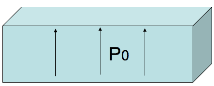

<section data-markdown="">

### PH410 - Electromagnetism

October 28

<!--this doesn't work... -->
</section>

<section data-markdown>

A dielectric slab (top area $A$, height $h$) has been polarized, with $\mathbf{P}=P_0$ in the $+z$ direction. What is the surface charge density, $\sigma_b$, on the bottom surface?

1. 0
2. $-P_0$
3. $P_0$
4. $P_0 A h$
5. $P_0 A$

Note:
* CORRECT ANSWER: B

</section>

<section data-markdown>

A dielectric sphere is uniformly polarized,

$$\mathbf{P} = +P_0\hat{z}$$

What is the surface charge density?

1. 0
2. Non-zero Constant
3. constant*$\sin \theta$
4. constant*$\cos \theta$
5.  ??

Note:
* CORRECT ANSWER: D

</section>

<section data-markdown>
A dielectric sphere is uniformly polarized,

$$\mathbf{P} = +P_0\hat{z}$$

What is the volume charge density?

1. 0
2. Non-zero Constant
3. Depends on $r$, but not $\theta$
4. Depends on $\theta$, but not $r$
5. ?

Note:
* CORRECT ANSWER: A

</section>
