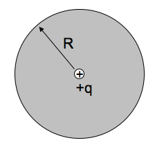
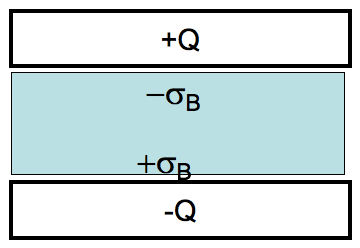

<section data-markdown="">

### PH410 - Electromagnetism

October 28

<!--this doesn't work... -->
</section>

<section data-markdown>

On slack while we wait...

A dielectric slab (top area $A$, height $h$) has been polarized, with $\mathbf{P}=P_0$ in the $+z$ direction. What is the surface charge density, $\sigma_b$, on the bottom surface?

1. 0
2. $-P_0$
3. $P_0$
4. $P_0 A h$
5. $P_0 A$

Note:
* CORRECT ANSWER: B

</section>

<section data-markdown>

A dielectric sphere is uniformly polarized,

$$\mathbf{P} = +P_0\hat{z}$$

What is the surface charge density?

1. 0
2. Non-zero Constant
3. constant*$\sin \theta$
4. constant*$\cos \theta$
5.  ??

Note:
* CORRECT ANSWER: D

</section>

<section data-markdown>
A dielectric sphere is uniformly polarized,

$$\mathbf{P} = +P_0\hat{z}$$

What is the volume charge density?

1. 0
2. Non-zero Constant
3. Depends on $r$, but not $\theta$
4. Depends on $\theta$, but not $r$
5. ?

Note:
* CORRECT ANSWER: A

</section>

<section data-markdown>

A solid non-conducting dielectric rod has been injected ("doped") with a fixed, known charge distribution $\rho(s)$. (The material responds, polarizing internally.)

When computing $D$ in the rod, do you treat this $\rho(s)$ as the "free charges" or "bound charges"?

1. "free charge"
2. "bound charge"
3. Neither of these - $\rho(s)$ is some combination of free and bound
4. Something else.

Note:
* CORRECT ANSWER: A

</section>

<section data-markdown>

We define $\mathbf{D} = \varepsilon_0 \mathbf{E} + \mathbf{P}$, with

$$\oint \mathbf{D}\cdot d\mathbf{A} = Q_{free}$$

A point charge $+q$ is placed at the center of a dielectric sphere (radius $R$).  There are no other free charges anywhere.  What is $|\mathbf{D}(r)|$?

1. $q/(4 \pi r^2)$ everywhere
2. $q/(4 \varepsilon_0\pi r^2)$ everywhere
3. $q/(4 \pi r^2)$ for $r < R$, but $q/(4 \varepsilon_0\pi r^2)$ for $r>R$
4. None of the above, it's more complicated
5. We need more info to answer!

Note:
* CORRECT ANSWER: A

</section>

<section data-markdown>

For linear dielectrics the relationship between the polarization, $\mathbf{P}$, and the total electric field, $\mathbf{E}$, is given by:

$$\mathbf{P} = \varepsilon_0 \chi_e \mathbf{E}$$

where $X_e$ is typically a known constant. Think about what happens if (1) $X_e \rightarrow 0$ or if (2) $X_e \rightarrow \infty$. What do each of these limits describe?

1.  (1) describes a metal and (2) describes vacuum
2.  (1) describes vacuum and (2) describes a metal
3. Any material can gave either $X_e \rightarrow 0$ or $X_e \rightarrow \infty$

Note:
* CORRECT ANSWER: B

</section>
<!--
<section data-markdown>

When there are no free charges, $\rho_{free}$ = 0, in a linear dielectric material, the electric potential, $V$, in that material satisfies Laplace's equation.

$$\nabla^2 V = 0$$

1. True
2. False
3. ???

Note:
* CORRECT ANSWER: A
* As we will show later.

</section>
-->
<section data-markdown>

A very large (effectively infinite) capacitor has charge $Q$. A neutral (*homogeneous*) dielectric is inserted into the gap (and of course, it will polarize). We want to find $\mathbf{E}$ everywhere.

Which equation would you head to first?

1. $\mathbf{D} = \varepsilon_0 \mathbf{E} + \mathbf{P}$
2. $\oint \mathbf{D}\cdot d\mathbf{A} = Q_{free}$
3. $\oint \mathbf{E}\cdot d\mathbf{A} = \frac{Q}{\varepsilon_0}$
4. More than one of these would work
5. Can't solve unless we know the dielectric is linear.

Note:
* CORRECT ANSWER: E
* If you don’t know it’s *linear*, then knowing D is not enough to determine E. (Even if it’s still x-y symmetric/infinite, you still don’t know how much it polarizes!)

</section>

<section data-markdown>

A very large (effectively infinite) capacitor has charge $Q$. A neutral (*homogeneous*) dielectric is inserted into the gap (and of course, it will polarize). We want to find $\mathbf{D}$ everywhere.

Which equation would you head to first?

1. $\mathbf{D} = \varepsilon_0 \mathbf{E} + \mathbf{P}$
2. $\oint \mathbf{D}\cdot d\mathbf{A} = Q_{free}$
3. $\oint \mathbf{E}\cdot d\mathbf{A} = \frac{Q}{\varepsilon_0}$
4. More than one of these would work

Note:
* CORRECT ANSWER: B
* The amount of free charge is known!

</section>

<section data-markdown>

An  ideal (large) capacitor has charge $Q$. A neutral linear dielectric is inserted into the gap. We want to find $\mathbf{D}$ in the dielectric.

$$\oint \mathbf{D}\cdot d\mathbf{A} = Q_{free}$$

For the Gaussian pillbox shown, what is $Q_{free,enclosed}$?

1. $\sigma A$
2. $-\sigma_B A$
3. $(\sigma-\sigma_B) A$
4. $(\sigma+\sigma_B) A$
5. Something else

Note:
* CORRECT ANSWER: A

</section>

<section data-markdown>

An  ideal (large) capacitor has charge $Q$. A neutral linear dielectric is inserted into the gap. We want to find $\mathbf{D}$ in the dielectric.

$$\oint \mathbf{D}\cdot d\mathbf{A} = Q_{free}$$

Is $\mathbf{D}$ zero INSIDE the metal? (i.e., on the top face of our cubical Gaussian surface)

1. It must be zero in there.
2. It depends.
3. It is definitely not zero in there.

Note:
* CORRECT ANSWER: A

</section>

<section data-markdown>

An  ideal (large) capacitor has charge $Q$. A neutral linear dielectric is inserted into the gap. We want to find $\mathbf{D}$ in the dielectric.

$$\oint \mathbf{D}\cdot d\mathbf{A} = Q_{free}$$

What is $|\mathbf{D}|$ in the dielectric?

1. $\sigma$
2. $2\sigma$
3. $\sigma/2$
4. $\sigma+\sigma_b$
5. Something else

Note:
* CORRECT ANSWER: A

</section>

<section data-markdown>

An ideal (large) capacitor has charge $Q$. A neutral linear dielectric is inserted into the gap. Now that we have $\mathbf{D}$ in the dielectric, what is $\mathbf{E}$ inside the dielectric?

1. $\mathbf{E} = \mathbf{D} \varepsilon_0 \varepsilon_r$
2. $\mathbf{E} = \mathbf{D}/\varepsilon_0 \varepsilon_r$
3. $\mathbf{E} = \mathbf{D} \varepsilon_0$
4. $\mathbf{E} = \mathbf{D}/\varepsilon_0$
5. Not so simple! Need another method

Note:
* CORRECT ANSWER: B

</section>
