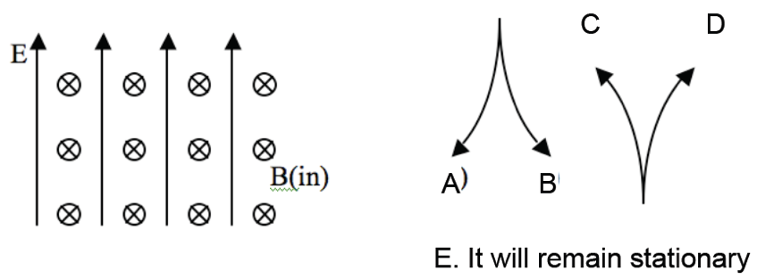
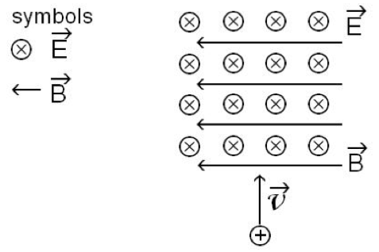
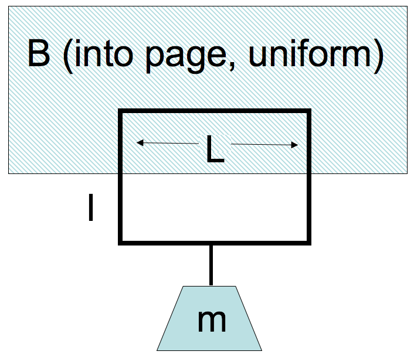
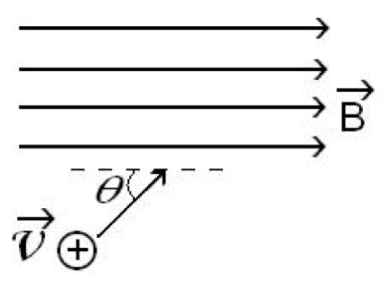
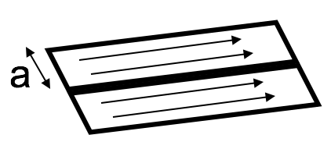

<section data-markdown="">

### PH410 - Electromagnetism

November 1
For Monday, read section 5.2.

<!--this doesn't work... -->
</section>

<section data-markdown>

A proton ($q=+e$) is released from rest in a uniform $\mathbf{E}$ and uniform $\mathbf{B}$.  $\mathbf{E}$ points up, $\mathbf{B}$ points into the page.  Which of the paths will the proton initially follow?

Note:
* CORRECT ANSWER: C
</section>

<section data-markdown>

A + charged particle moving up (speed $v$) enters a region with uniform $\mathbf{B}$ (left) and uniform $\mathbf{E}$ (into page). What's the direction of $\mathbf{F}_{net}$ on the particle, at the instant it enters the region?

1. To the left
2. Into the page
3. Out of the page
4. No net force
5. Not enough information

Note:
* CORRECT ANSWER: E
* The forces point in opposite directions, but not sure of their size
</section>

<section data-markdown>

A wire loop in a $B$ field has a current $I$. The B-field is localized, it's only in the hatched region, roughly zero elsewhere. Which way is $I$ flowing to hold the mass in place?

1. Clockwise
2. Counter-clockwise
3. You cannot "levitate" like this!

Note:
* CORRECT ANSWER: A

</section>

<section data-markdown>

A proton (speed $v$) enters a region of uniform $\mathbf{B}$. $v$ makes an angle $\theta$ with $\mathbf{B}$. What is the subsequent path of the proton?

1. Helical
2. Straight line
3. Circular motion, $\perp$ to page. (plane of circle is $\perp$ to $\mathbf{B}$)
4. Circular motion, $\perp$ to page. (plane of circle at angle $\theta$ w.r.t. $\mathbf{B}$)
5. Impossible.  $\mathbf{v}$ should always be $\perp$ to $\mathbf{B}$

Note:
* CORRECT ANSWER: A
</section>

<section data-markdown>

Positive ions flow right through a liquid, negative ions flow left. The spatial density and speed of both ions types are identical. Is there a net current through the liquid?

1. Yes, to the right
2. Yes, to the left
3. No
4. Not enough information given

Note:
* CORRECT ANSWER: A

</section>

<section data-markdown>

Current $I$ flows down a wire (length $L$) with a square cross section (side $a$). If it is uniformly distributed over the entire wire area, what is the magnitude of the volume current density $J$?

1. $J = I/a^2$
2. $J = I/a$
3. $J = I/4a$
4. $J = a^2I$
5. None of the above

Note:
* CORRECT ANSWER: A

</section>

<section data-markdown>

We defined the volume current density in terms of the differential, $\mathbf{J} \equiv \dfrac{d\mathbf{I}}{da_{\perp}}$.

When is it ok to determine the volume current density by taking the ratio of current to cross-sectional area?
$$\mathbf{J} \stackrel{?}{=} \dfrac{\mathbf{I}}{A}$$

1. Never
2. Always
3. $I$ is uniform
4. $I$ is uniform and $A$ is $\perp$ to $I$
5. None of these

Note:
* CORRECT ANSWER: D

</section>

<section data-markdown>

Current $I$ flows down a wire (length $L$) with a square cross section (side $a$). If it is uniformly distributed over the outer surfaces only, what is the magnitude of the surface current density $K$?

1. $K = I/a^2$
2. $K = I/a$
3. $K = I/4a$
4. $K = aI$
5. None of the above

Note:
* CORRECT ANSWER: C

</section>

<section data-markdown>

A "ribbon" (width $a$) of surface current flows (with surface current density $K$). Right next to it is a second identical ribbon of current. Viewed collectively, what is the new total surface current density?

1. $K$
2. $2K$
3. $K/2$
4. Something else

Note:
* CORRECT ANSWER: A

</section>

<section data-markdown>

Which of the following is a statement of charge conservation?

1. $\dfrac{\partial \rho}{\partial t} = -\nabla \mathbf{J}$
2. $\dfrac{\partial \rho}{\partial t} = -\nabla \cdot \mathbf{J}$
3. $\dfrac{\partial \rho}{\partial t} = -\int \nabla \cdot \mathbf{J} d\tau$
4. $\dfrac{\partial \rho}{\partial t} = -\oint \mathbf{J} \cdot d\mathbf{A}$

Note:
* CORRECT ANSWER: B

</section>
