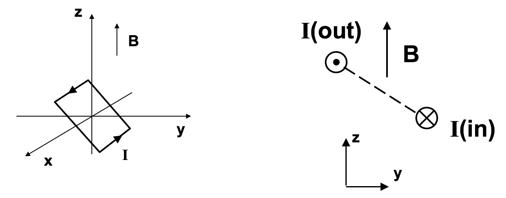

<section data-markdown="">

### PH410 - Electromagnetism

November 11

For Wednesday, read section 6.2
</section>

<section data-markdown>

What is the physical interpretation of $\oint \mathbf{A} \cdot d\mathbf{l}$?

1. The current density $\mathbf{J}$
2. The magnetic field $\mathbf{B}$
3. The magnetic flux $\Phi_B$
4. It's none of the above, but is something simple and concrete
5. It has no particular physical interpretation at all

Note:
* CORRECT ANSWER: C

</section>

<section data-markdown>
The leading term in the vector potential multipole expansion involves:

$\oint d\mathbf{l}'$

What is the magnitude of this integral?

1. $R$
2. $2\pi R$
3. 0
4. Something entirely different/it depends!

Note:
* CORRECT ANSWER: C

</section>

<section data-markdown>

The vector potential for the dipole is:

$\mathbf{A}_d = \dfrac{\mu_0}{4\pi r^2} \mathbf{m} \times \hat{\mathbf{r}}$

What is the magnitude of that cross product $|\mathbf{m} \times \hat{\mathbf{r}}|$?

1. 1
2. $m$
3. $m r\sin\theta$
4. $m\sin\theta$
5. Something else?

Note: Correct Answer is D

</section>

<section data-markdown>

The vector potential for the dipole is:

$\mathbf{A}_d = \dfrac{\mu_0}{4\pi r^2} \mathbf{m} \times \hat{\mathbf{r}}$

If the magnetic dipole moment points in the $\hat{\mathbf{z}}$ direction, what is the direction of the $\mathbf{A}_d$?

1. $\hat{\mathbf{z}}$
2. $\hat{\mathbf{\phi}}$
3. $\hat{\mathbf{r}}$
4. $\hat{\mathbf{m}}$
5. Something else?

Note: Correct Answer is B

</section>

<section data-markdown>

Two magnetic dipoles $m_1$ and $m_2$ (equal in magnitude) are oriented in three different ways.

Which ones can produce a dipole field at large distances?

1. None of these
2. All three
3. 1 only
4. 1 and 2 only
5. 1 and 3 only

Note:
* CORRECT ANSWER: E

</section>

<section data-markdown>

Two magnetic dipoles $m_1$ and $m_2$ (**unequal** in magnitude) are oriented in three different ways.

Which ones can produce a dipole field at large distances?

1. None of these
2. All three
3. 1 only
4. 1 and 2 only
5. 1 and 3 only

Note:
* CORRECT ANSWER: B

</section>
<section data-markdown>

The force on a segment of wire $L$ is $\mathbf{F} = I \mathbf{L} \times \mathbf{B}$ A current-carrying wire loop is in a constant magnetic field $\mathbf{B} = B \hat{z}$ as shown. What is the direction of the torque on the loop?

1. Zero
2. +x
3. +y
4. +z
5. None of these

Note:
* CORRECT ANSWER: B
</section>

<section data-markdown>

The torque on a magnetic dipole in a B field is:

$\mathbf{\tau} = \mathbf{m} \times \mathbf{B}$

How will a small current loop line up if the B field points uniformly up the page?

</section>

<section data-markdown>

Consider a paramagnetic material placed in a uniform external magnetic field, $\mathbf{B}_{ext}$. The paramagnetic magnetizes, so that the total magnetic field just outside the material is now...

1. smaller than
2. larger than
3. the same as

it was before the material was placed.

Note:
* Correct Answer: B

</section>
